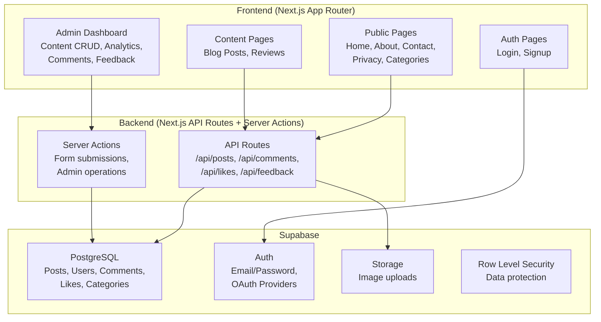
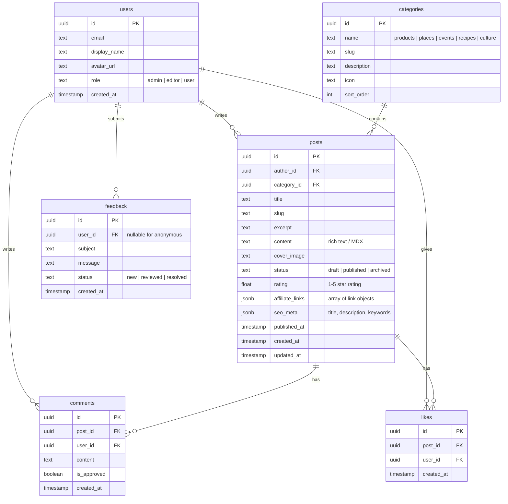

# VantageVerdict — Multi-Category Review Blog

A full-stack, SEO-optimized content platform for reviewing **products, places, events, recipes, and culture**, with community engagement features and affiliate monetization.

---

## User Review Required

> [!IMPORTANT]
> **Tailwind CSS Version**: You mentioned Tailwind CSS. The latest is **v4** (CSS-first config, no `tailwind.config.js`). Should I use **Tailwind v4** (modern, simpler) or **Tailwind v3** (more mature ecosystem, broader plugin support)? I'll default to **v4** unless you say otherwise.

> [!IMPORTANT]
> **Database — Supabase Cloud vs Local PostgreSQL**: Using **Supabase (cloud)** gives us instant auth, real-time subscriptions, and a hosted Postgres with zero setup. A **local PostgreSQL + Prisma** setup gives full offline development but requires more configuration. I recommend **Supabase** for speed-to-launch. Please confirm.

> [!WARNING]
> **Deployment Target**: The plan assumes deployment to **Vercel** (optimal for Next.js). If you prefer a different host (e.g., shared hosting, AWS, DigitalOcean), the architecture will need adjustments — Next.js App Router with server components does **not** work on traditional shared hosting.

> [!IMPORTANT]
> **Content Seeding**: For launch, should I create **placeholder/demo content** across all 5 categories so the site looks populated? Or will you provide real content to seed?

## Open Questions

1. **Domain & Hosting**: Do you already have a domain registered? Are you using Vercel for hosting?
2. **Auth Providers**: Should login support **email/password only**, or also **Google / GitHub OAuth**?
3. **Affiliate Integration**: Do you have specific affiliate networks in mind (Amazon Associates, ShareASale, etc.), or should I build a generic affiliate link manager in the admin dashboard?
4. **Admin Access**: Should admin be a hardcoded role (e.g., specific email), or do you need a full role-based access system (Admin, Editor, Viewer)?
5. **Email Notifications**: Do you need email notifications for new comments, feedback submissions, etc.?

---

## Proposed Architecture



### Tech Stack Summary

| Layer | Technology | Rationale |
|-------|-----------|-----------|
| Framework | Next.js 15 (App Router) | SSR/SSG for SEO, server components, API routes |
| Styling | Tailwind CSS v4 | User-requested, rapid UI development |
| Database | Supabase (hosted PostgreSQL) | Auth + DB + Storage in one platform |
| ORM | Supabase JS Client | Native integration, RLS support |
| Auth | Supabase Auth | Built-in email/OAuth, session management |
| Deployment | Vercel | Zero-config Next.js hosting, edge network |
| Rich Text | Tiptap or MDX | Admin content editor for blog posts |
| SEO | next-sitemap + next/metadata API | Automated sitemap, structured metadata |
| Analytics | Google Analytics 4 | Traffic tracking, user engagement |
| Icons | Lucide React | Consistent, modern icon set |

---

## Database Schema



---

## Proposed Changes

### Sprint 1 — Project Scaffolding & Design System

#### [NEW] Project initialization
- Initialize Next.js 15 with App Router via `npx create-next-app`
- Install Tailwind CSS v4, Supabase JS, Lucide React
- Configure TypeScript, ESLint, path aliases

#### [NEW] `src/app/layout.tsx`
- Root layout with Google Fonts (Inter + Playfair Display)
- Global metadata, viewport config
- Dark/light theme provider

#### [NEW] `src/app/globals.css`
- Tailwind v4 imports
- CSS custom properties for design tokens (colors, spacing, typography)
- Premium dark mode palette with accent gradients

#### [NEW] `src/lib/supabase/client.ts` & `server.ts`
- Supabase client for browser and server components
- Environment variable configuration

#### [NEW] `src/components/ui/` (design system)
- `Button.tsx` — Primary, secondary, ghost variants with hover animations
- `Card.tsx` — Glassmorphism card with hover lift effect
- `Badge.tsx` — Category badges with color coding
- `Input.tsx` — Styled form inputs with validation states
- `StarRating.tsx` — Interactive/display star rating component
- `Avatar.tsx` — User avatar with fallback initials
- `Modal.tsx` — Animated modal dialog
- `Skeleton.tsx` — Loading skeleton components
- `Toast.tsx` — Notification toast system

---

### Sprint 2 — Navigation & Static Pages

#### [NEW] `src/components/layout/Header.tsx`
- Sticky header with glassmorphism effect
- Logo, category navigation, search, auth buttons
- Mobile hamburger menu with slide-in animation
- User avatar dropdown when logged in

#### [NEW] `src/components/layout/Footer.tsx`
- Multi-column footer with categories, social links, newsletter
- Copyright and legal links

#### [NEW] `src/app/page.tsx` (Home)
- Hero section with featured review carousel
- Category quick-nav with animated cards
- Latest reviews grid (3-column responsive)
- "Most Liked" sidebar section
- Newsletter signup CTA

#### [NEW] `src/app/about/page.tsx`
- Mission statement, team section
- Category philosophy cards

#### [NEW] `src/app/contact/page.tsx`
- Contact form with validation
- Social media links

#### [NEW] `src/app/privacy/page.tsx`
- Privacy policy and affiliate disclosure
- Cookie policy section

---

### Sprint 3 — Authentication System

#### [NEW] `src/app/auth/login/page.tsx`
- Email/password login form
- OAuth buttons (Google, GitHub — if confirmed)
- "Forgot password" flow
- Animated form transitions

#### [NEW] `src/app/auth/signup/page.tsx`
- Registration form with display name, email, password
- Terms acceptance checkbox
- Password strength indicator

#### [NEW] `src/app/auth/callback/route.ts`
- OAuth callback handler

#### [NEW] `src/lib/auth/middleware.ts`
- Route protection middleware
- Admin route guard
- Session refresh logic

#### [NEW] `src/components/auth/AuthProvider.tsx`
- React context for auth state
- Session persistence across navigation

---

### Sprint 4 — Content System & Category Pages

#### [NEW] `src/app/[category]/page.tsx`
- Dynamic category landing pages (products, places, events, recipes, culture)
- Filterable grid of posts with sort options (newest, top-rated, most liked)
- Category hero with description and stats
- Pagination or infinite scroll

#### [NEW] `src/app/[category]/[slug]/page.tsx`
- Full blog post / review page
- Cover image with parallax effect
- Star rating display
- Author info card
- Affiliate link callout boxes (styled CTA buttons)
- Related posts carousel
- Share buttons (copy link, Twitter, Facebook)
- Like button with animation
- Comment section

#### [NEW] `src/components/post/PostCard.tsx`
- Review card with image, title, excerpt, rating, category badge
- Hover reveal of like count and read time
- Smooth scale-up animation on hover

#### [NEW] `src/components/post/ShareButtons.tsx`
- Social share buttons with copy-to-clipboard

#### [NEW] `src/components/post/AffiliateBox.tsx`
- Styled affiliate link CTA with disclosure badge

---

### Sprint 5 — Engagement Features (Likes, Comments, Feedback)

#### [NEW] `src/app/api/likes/route.ts`
- Toggle like (add/remove) for authenticated users
- Return updated like count

#### [NEW] `src/app/api/comments/route.ts`
- CRUD for comments
- Moderation flag support
- Pagination

#### [NEW] `src/components/post/LikeButton.tsx`
- Animated heart button with count
- Optimistic UI updates
- Login prompt for unauthenticated users

#### [NEW] `src/components/post/CommentSection.tsx`
- Threaded comment list
- Comment form with rich text (basic formatting)
- Time-ago timestamps
- Admin approval badges

#### [NEW] `src/app/feedback/page.tsx`
- Feedback submission form (subject, message, category)
- Success confirmation with animation

#### [NEW] `src/app/api/feedback/route.ts`
- Store feedback in database
- Optional email notification to admin

---

### Sprint 6 — Admin Dashboard

#### [NEW] `src/app/admin/layout.tsx`
- Admin-only layout with sidebar navigation
- Route protection (redirect non-admins)

#### [NEW] `src/app/admin/page.tsx` (Dashboard Overview)
- Stats cards (total posts, comments, users, feedback)
- Recent activity feed
- Quick action buttons
- Charts for engagement trends (using Recharts or similar)

#### [NEW] `src/app/admin/posts/page.tsx`
- Posts table with search, filter by category/status
- Quick actions: edit, publish, archive, delete

#### [NEW] `src/app/admin/posts/new/page.tsx` & `[id]/edit/page.tsx`
- Rich text editor (Tiptap) for content creation
- Image upload to Supabase Storage
- Category selection, rating input
- Affiliate link manager (add/remove links with URL + label)
- SEO meta fields (title, description, keywords)
- Draft / Publish toggle

#### [NEW] `src/app/admin/comments/page.tsx`
- Comment moderation queue
- Approve / reject / delete actions
- Filter by post, user, status

#### [NEW] `src/app/admin/feedback/page.tsx`
- Feedback inbox with status management
- Mark as reviewed / resolved

#### [NEW] `src/app/admin/users/page.tsx`
- User list with roles
- Ban / promote actions

---

### Sprint 7 — SEO & Performance

#### [NEW] `src/app/sitemap.ts`
- Dynamic sitemap generation from all published posts
- Category pages, static pages

#### [NEW] `src/app/robots.ts`
- robots.txt generation

#### [MODIFY] All page files — metadata
- Dynamic `generateMetadata()` for all pages
- Open Graph and Twitter Card meta tags
- Structured data (JSON-LD) for reviews (Product, Review schema)
- Canonical URLs

#### Performance optimizations
- `next/image` for all images with proper sizing
- Dynamic imports for heavy components (editor, charts)
- Suspense boundaries with skeleton loading states
- ISR (Incremental Static Regeneration) for published posts

---

### Sprint 8 — Analytics, Polish & Launch Prep

#### [MODIFY] `src/app/layout.tsx`
- Add Google Analytics 4 script
- Cookie consent banner

#### [NEW] `src/components/common/CookieConsent.tsx`
- GDPR-compliant cookie consent banner

#### Cross-browser & responsive testing
- Test on Chrome, Firefox, Safari, Edge
- Mobile, tablet, desktop breakpoints
- Lighthouse audit (target 90+ on all metrics)

#### Content seeding
- Create 2-3 sample reviews per category (10-15 total)
- Generate cover images using image generation

#### Deployment
- Deploy to Vercel
- Configure custom domain
- Set up HTTPS (automatic on Vercel)
- Submit sitemap to Google Search Console

---

## Project Structure

```
VantageVerdict/
├── src/
│   ├── app/
│   │   ├── layout.tsx              # Root layout
│   │   ├── page.tsx                # Home page
│   │   ├── globals.css             # Global styles
│   │   ├── about/page.tsx
│   │   ├── contact/page.tsx
│   │   ├── privacy/page.tsx
│   │   ├── feedback/page.tsx
│   │   ├── auth/
│   │   │   ├── login/page.tsx
│   │   │   ├── signup/page.tsx
│   │   │   └── callback/route.ts
│   │   ├── [category]/
│   │   │   ├── page.tsx            # Category listing
│   │   │   └── [slug]/page.tsx     # Individual post
│   │   ├── admin/
│   │   │   ├── layout.tsx
│   │   │   ├── page.tsx            # Dashboard
│   │   │   ├── posts/
│   │   │   │   ├── page.tsx
│   │   │   │   ├── new/page.tsx
│   │   │   │   └── [id]/edit/page.tsx
│   │   │   ├── comments/page.tsx
│   │   │   ├── feedback/page.tsx
│   │   │   └── users/page.tsx
│   │   ├── api/
│   │   │   ├── likes/route.ts
│   │   │   ├── comments/route.ts
│   │   │   └── feedback/route.ts
│   │   ├── sitemap.ts
│   │   └── robots.ts
│   ├── components/
│   │   ├── ui/                     # Design system
│   │   ├── layout/                 # Header, Footer
│   │   ├── post/                   # Post-related components
│   │   ├── auth/                   # Auth provider
│   │   └── common/                 # Shared components
│   ├── lib/
│   │   ├── supabase/               # Supabase clients
│   │   ├── auth/                   # Auth utilities
│   │   └── utils.ts                # Helper functions
│   └── types/
│       └── index.ts                # TypeScript types
├── public/
│   └── images/                     # Static assets
├── next.config.ts
├── tailwind.config.ts              # (if v3) or postcss.config.ts
├── tsconfig.json
├── package.json
└── .env.local                      # Supabase keys
```

---

## Verification Plan

### Automated Tests
- `npm run build` — Verify zero build errors
- `npm run lint` — ESLint checks pass
- Lighthouse CLI audit — Target 90+ across Performance, Accessibility, Best Practices, SEO

### Manual Verification
- Navigate all public pages and verify rendering
- Sign up, log in, log out — full auth flow
- Create, edit, publish a post from admin dashboard
- Like a post, add a comment, submit feedback
- Verify mobile responsiveness at 375px, 768px, 1024px, 1440px
- Verify dark/light mode toggle
- Check SEO meta tags in page source
- Test affiliate link rendering and click-through
- Cross-browser testing (Chrome, Firefox, Edge)

### Browser Testing
- Use browser tool to verify each page visually
- Screenshot key pages for walkthrough documentation
